# 🚀🚀🚀 redux 及部分中间件的实现 🙂
## 🔨 redux 实现 [仓库链接](https://github.com/cao-lianhui/react-study-notes/tree/main/src/redux-mini)

#### 1. redux 简介
    - 是 react 组件通信方式之一，使组件在状态变更时变得可预测，可控制
    - 整个应用状态存在唯一的 store 中
    - 变更状态只能通过组件派发(dispatch)行为(action)给 store，由纯函数 reducer 接收并返回新的状态
    - 组件通过发布订阅的方式来刷新自己的视图

#### 2. redux 通信方式流程图👇👇👇

    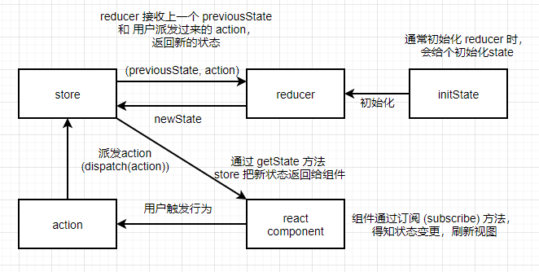

#### 3. redux 简版实现
    
    3.1 redux 会通过 createStore 生成 store
    ```
    /**
    * 先清楚 redux 中的几个概念
    * 1. action：为一个对象，用户创建的行为，指发生什么动作，可以类比一个指令
    * 2. dispatch: 为一个方法，接收用户创建的 action，派发给 store
    * 3. reducer：为一个纯函数，接收用户派发过来的 action 和上一次更新的 state ，返回最新的 state
    * 4. store：为状态容器，通过 createStore 生成，包含三个方法
    *  4.1. getState: 返回当前状态
    *  4.2. dispatch: 派发状态，同时触发订阅事件
    *  4.3. subscribe: 监听订阅事件
    */
    // createStore 实现
    function createStore(reducer){
        // 存储当前状态
        let currentState;
        // 该数组用于存储所有订阅事件
        let currentListeners = [];
        // 返回当前的状态
        function getState(){
            return currentState;
        }
        function dispatch(action){
            // 接收 state 和 action，返回最新的 state
            currentState = reducer(currentState, action);
            // 返回新的 state 后需要触发订阅事件，使视图更新
            currentListeners.forEach(lis => lis());
        }
        function subscribe(listener){
            // 监听订阅事件
            currentListeners.push(listener);
            // 返回一个函数取消订阅
            return () => {
                currentListeners = currentListeners.filter(lis => lis !== listener);
                // 源码里通过获取索引的方式然后 splice 删除订阅事件
                // const index = currentListeners.indexOf(listener)
                // currentListeners.splice(index, 1)
            }
        }
        // 初始化状态
        dispatch({})
        
        // 返回对应的 store 方法
        return {
            getState,
            dispatch,
            subscribe
        }
    }
    ```

    3.1 测试实现的 redux，仍然是用计数器作为例子(该例子如有雷同纯属必然😜)

    3.1.1 创建 store/index.js
    ```
    import { createStore } from '../redux-mini';
    // 初始化 state
    const initState = 0
    // 声明一个计数器 reducer
    const countReducer = (state = initState, { type, payload }) => {
        switch(type){
            case 'ADD': return state + payload
            case 'MINUS': return state - payload
            default: return state;
        }
    }
    // 传入 reducer 函数，生成 store
    const store = createStore(countReducer);
    export default store;

    ```

    3.1.2 创建 ReduxPage.js 组件，并在 index.js 中引入该组件
    ```
    // ReduxPage.js
    import { Component } from 'react';
    // 引入 store
    import store from '../store';

    export default class ReduxPage extends Component{
        componentDidMount(){
            // 注册监听事件
            this.cancel = store.subscribe(() => {
                // 状态变更时更新视图
                this.forceUpdate()
            })
        }

        componentWillUnmount(){
            // 组件卸载时取消订阅
            this.cancel && this.cancel();
        }

        handleAdd = () => {
            // 触发 dispatch
            store.dispatch({ type: 'ADD', payload: 1 })
        }
        handleMinus = () => {
            // 触发 dispatch
            store.dispatch({ type: 'MINUS', payload: 1 })
        }

        render(){
            return (
                <div>
                    <h2>reduxPage</h2>
                    <div>count:{ store.getState().count }</div>
                    <button onClick={this.handleAdd}>+</button>
                    <button onClick={this.handleMinus}>-</button>
                </div>
            )
        }
    }
    // index.js
    import React from 'react';
    import ReactDOM from 'react-dom';
    import './index.css';
    import ReduxPage from './pages/ReduxPage';
    ReactDOM.render(
    <React.StrictMode>
        <ReduxPage />
    </React.StrictMode>,
    document.getElementById('root')
    );
    ```

    3.1.3 如图浏览器中显示的结果，连续派发多次 action 后，视图对应变更，
    
    状态打印在浏览器控制台，第一次打印 undefined，为 dispatch 
    
    在 createStore 里初始化的时候

    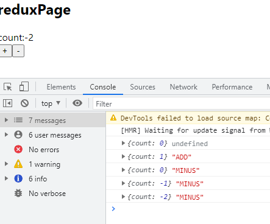

#### 4. redux 中 combinReducers 实现

    通常在一个项目中肯定不止一个状态需要变更，而是多个状态，每个状态对应的信息又会有不同，
    
    放在一个 reducer 里，会非常庞大，可读性也会变差，这时就需要创建多个 reducer，对应不同的状态。

    如下所示

    ```
    const multiState = {
        msg: '状态',
        count: 0,
        bool: true
    }
    const multiReducer = (state = multiState, { type, payload }) => {
        switch(type){
            case 'MSG':
                return Object.assign(state, {
                    ...state,
                    msg: payload
                })
            case 'COUNT':
                return Object.assign(state, {
                    ...state,
                    count: payload + 1
                })
            case 'BOOL':
                return Object.assign(state, {
                    ...state,
                    bool: payload
                })
            default:
                return state;
        }
    }
    ```

    状态中有三个属性需要变更，每个属性之间没有联系，变更的方式可能会不同，所以需要创建

    多个 reducer，每个 reducer 返回对应的属性状态。但在 redux 中createStore 中只传入单
    
    个 reducer，所以我们需要把创建的多个 reducer 合并成单个，称为 combineReducers。

    ```
    // combineReducers 接收一个 reducer 组成的对象集合
    // 传入的 reducers 对象中的属性必须与 state 属性名相同，否则无法获取到对应的 reducer 修改状态
    function combineReducers(reducers){
        return function combination(state = {}, action){
            const reducerKeys = Object.keys(reducers);
            // 判断状态是否改变
            let hasChanged = false;
            const nextState = {};
            for(let i = 0; i < reducerKeys.length; i++){
                // 获取当前状态属性
                const key = reducerKeys[i];
                // 获取当前状态属性对应的 reducer
                const reducer = reducers[key];
                // 获取当前状态属性对应的上一个 state
                const previousStateKey = state[key];
                // 获取当前状态属性对应的最新状态
                const nextStateKey = reducer(previousStateKey, action);
                // 把最新的状态赋值给当前 state
                nextState[key] = nextStateKey;
                hasChanged = hasChanged || nextStateKey !== previousStateKey
            }
            hasChanged = hasChanged || reducerKeys.length !== Object.keys(state).length;
            // 状态没改变则返回老 state， 否则返回新的
            return hasChanged ? nextState : state;
        }
    }

    ```
    上面代码除了 ts 和一些异常处理之外，实现方式基本是按 redux 源码搬过来的，
    
    阮一峰老师博客是通过 reduce：[链接👉](https://www.ruanyifeng.com/blog/2016/09/redux_tutorial_part_one_basic_usages.html)

    来实现的，代码如下：👇👇👇
    ```
    
    const combineReducers = reducers => {
        return (state = {}, action) => {
            return Object.keys(reducers)
            .reduce((newState, key) => {
                newState[key] = reducers[key](state[key], action);
                // console.log('newState', state)
                return newState;
            }, {})
        }
    }
    ```

    5.1  combineReducers 测试

    修改 store/index.js
    ```
    const multiState = {
        msg: '状态',
        count: 0,
        bool: 'bool'
    }
    const msgReducer = (state = multiState.msg, { type, payload }) => {
        switch(type){
            case 'MSG':
                return state + payload;
            default: 
            return state;
        }
    }
    const couReducer = (state = multiState.count, { type, payload }) => {
        switch(type){
            case 'ADD': return state + payload;
            case 'MINUS': return state - payload;
            default: return state;
        }
    }
    const boolReducer = (state = multiState.bool, { type, payload }) => {
        switch(type){
            case 'BOOL':
                return state + payload;
            default:
                return state;
        }
    }
    // 传入 reducer 函数，生成 store
    const rootReducer = combineReducers({
        msg: msgReducer,
        count: couReducer,
        bool: boolReducer,
    })
    const store = createStore(rootReducer);
    export default store;
    ```
    修改 ReduxPage.js 增加了三个函数和对应的状态显示
    ```
    handleMSG = () => {
        store.dispatch({ type: 'MSG', payload: '信息' })
    }
    handleCOUNT = () => {
        store.dispatch({ type: 'ADD', payload: 1 })
    }
    handleBOOL = () => {
        store.dispatch({ type: 'BOOL', payload: 'bool' })
    }

    render(){
        return (
            <div>
                <h2>reduxPage</h2>
                <div>msg:{ store.getState().msg }</div>
                <div>cou:{ store.getState().cou }</div>
                <div>bool:{ store.getState().bool }</div>
                <button onClick={this.handleMSG}>msg</button>
                <button onClick={this.handleCOUNT}>count</button>
                <button onClick={this.handleBOOL}>bool</button>
            </div>
        )
    }
    ```
    结果图：

    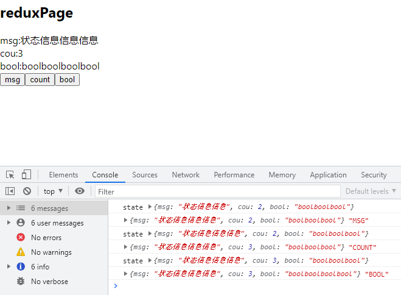

#### 5. 实现 applyMiddleware 中间件机制

    到这里一个基本的 redux 就实现了，不过还是有一个问题，目前实现的 redux 中的 dispatch 函数只支持对象形式，

    都是同步的，并不支持异步的方式，在实际项目中肯定少不了接口请求，还有分离日志记录、崩溃报告等等，这时就需要通过一个中间件机制来加强 dispatch 函数，

    在 redux 里通过 applyMiddleware 来引增强 dispatch 函数，

    👉[redux中文文档里有描述 applyMiddleware 的由来](https://www.redux.org.cn/docs/advanced/Middleware.html)，摘抄下面三段：

    - applyMiddleware只暴露一个 store API 的子集给 middleware：dispatch(action) 和 getState()。

    - 它用了一个非常巧妙的方式，以确保如果你在 middleware 中调用的是 store.dispatch(action) 而不是 next(action)，那么这个操作会再次遍历包含当前 middleware 在内的整个 middleware 链。这对异步的 middleware 非常有用，正如我们在之前的章节中提到的。

    - 为了保证你只能应用 middleware 一次，它作用在 createStore() 上而不是 store 本身。因此它的签名不是 (store, middlewares) => store， 而是 (...middlewares) => (createStore) => createStore。

    上面三段话总结下来，该中间件机制的实现需要把 createStore 作为参数传进去，在 applyMiddleware 里调用 

    createStore 获取 store，然后收集 store 的一些子集 API，并对 dispatch 函数加强。嗯，就是这样🤔

    接下来进入 createStore.js 修改该函数。在原来的基础上做了两处修改，这里直接截图：

    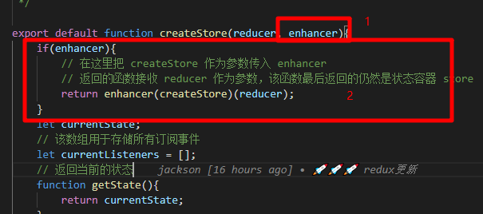

    上面函数修改好后，新建 applyMiddleware 文件，实现该中间件机制，具体看代码注释：)
    ```
    /**
    * 
    * @param  {...any} middlewares 传入的中间件集合
    * 比如：applyMiddleware(thunk, logger)
    */
    export default function applyMiddleware(...middlewares){
        // 传入 createStore 获取 store 和一些子集 API
        return function (createStore){
            // 传入 reducer，最后返回 store 和增强的 dispatch
            return function (reducer){
                // 获取 store 最后需要返回
                const store = createStore(reducer);
                // 获取 dispatch 函数
                let dispatch = store.dispatch;
                // 暴露一些 store API 给中间件，reudx 源码内也是这样写的
                const midAPI = {
                    getState: store.getState,
                    dispatch: (action, ...args) => dispatch(action, ...args)
                }
                // 遍历中间件函数，增强 dispatch
                // 这里我用了 redux  中文文档描述的形式，直接 forEach 遍历
                // redux 源码采用的是组合 compose 形式，用 reduce 遍历形成链式调用
                middlewares.forEach(middleware => {
                    // middleware 表示 logger 或 thunk 这些 redux 中间件
                    // 中间件最终会返回新的 dispatch 函数，改变原始的 dispatch，
                    // 改变的 dispatch 在作为参数传入，这样一层层叠加，形成链式调用的效果
                    dispatch = middleware(midAPI)(dispatch)
                    // 每个中间件的形式大概是下面这样的，最后返回新的 dispatch
                    // dispatch = ({ getState, dispatch }) => ( dispatch ) => action => {}
                    // 比如中间件 middlewares 的集合为[M1, M2, M3]
                    // 最后的返回结果从左向右包裹为 M3(M2(M1(dispatch)))
                    // 源码里compose 形式为从右向左包裹返回 M1(M2(M3(dispatch)))
                })
                // 返回 store, 增强后的 dispatch
                return {
                    ...store,
                    dispatch
                }
            }
        }
    }
    ```

    上面实现了 applyMiddleware 函数，接下测试下能不能正常使用
    
    先安装三个 redux 中间件

    ```
    yarn add redux-thunk redux-logger redux-pormise -D
    ```

    修改 store/index.js 文件

    引入三个中间件和 applyMiddleware 函数

    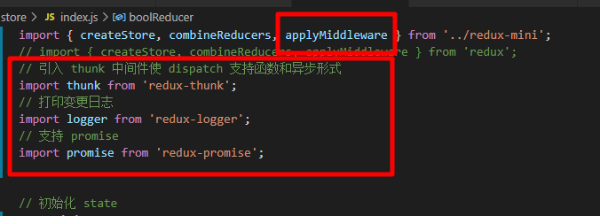

    再修改 createStore 函数

    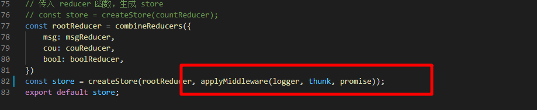

    接下来还要对 ReduxPage.js 进行下改动

    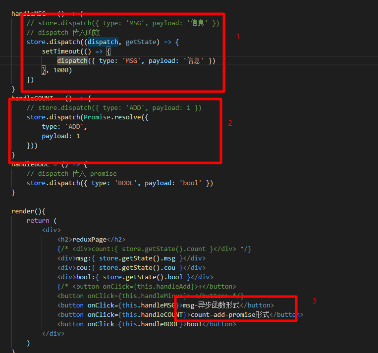

    最后的结果图
    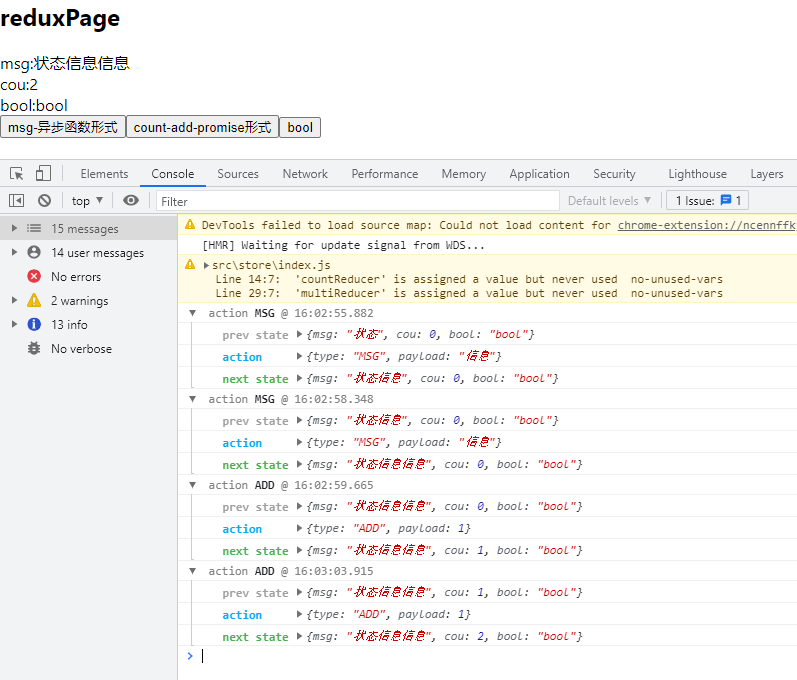

    可以看到浏览器中 redux 可以支持函数和 promise 形式进行状态变更，同时浏览器控制台

    打印出了相应的日志记录✌

#### 6. 实现 bindActionCreators 

    上面 redux API 实现的基本都实现了，还剩下最后一个 API: bindActionCreators。该函数主要是配合 react-redux 使用

    作用是把一个不带 dispatch 的函数升级为 dispatch(func(...args))，注意 func 返回值为 action

    ```
    // bindActionCreators 实现，也是参照源码来的🙂
    export default function bindActionCreators(creators, dispatch){
        const bindCreators = {}
        for(const key in creators){
            if(typeof creators[key] === 'function'){
                // 在这里接收带有 dispatch 的函数
                bindCreators[key] = bindActionCreator(creators[key], dispatch);
            }
        }
        return bindCreators;
    }

    // 为函数添加上 dispatch
    function bindActionCreator(creators, dispatch){
        return (...args) => dispatch(creators(...args))
    }
    ```

    到这里 redux 的所有 API 就都实现了，接下来我们可以手动实现上面安装过的三个中间件，顺便测试下简版的 redux

## 🔨 redux 中间件实现

#### 1. 中间件简介

关于 redux 中间件的表现形式在[redux 中文文档里有描述](https://www.redux.org.cn/docs/advanced/Middleware.html)，

在上面实现 applyMiddleware 时，可以知道中间件的表现形式大概是这样的

 ({ getState, dispatch }) => (next) => (action) => { /*中间件要处理的事情*/ }

 为了方便理解些，下面实现没有采用箭头函数的方式

#### 2. 中间件 redux-thunk 实现 [原版源码](https://github.com/reduxjs/redux-thunk/blob/master/src/index.js)
    ```
    // redux-thunk 中间件让 dispatch 支持函数和异步形式，主要对传入的 action 进行类型判断，它的简版实现方式为
    function thunk({ getState, dispatch }){
        return function(next){
            return function(action){
                if(typeof action === 'function'){
                    // 判断如何 action 类型为函数，则向该函数传入 dispatch 和 getState
                    return action(dispatch, getState)
                }
                return next(action)
            }
        }
    }
    ```
#### 3. 中间件 redux-promise 实现 [原版源码](https://github.com/redux-utilities/redux-promise/blob/master/src/index.js)
    ```
    // 该中间件让 dispatch 支持 promise 形式，同 redux-thunk 一样也是判断 action 类型
    // 只不过一个是判断函数，一个是 promise
    // 这里我安装了一个插件 is-promise 判断是否为 promise
    // yarn add is-promise -D
    // import isPromise from 'is-promise'
    function promise({ dispatch }){
        return function (next){
            return function (action){
                if(isPromise(action)){
                    // 判断 action 是否为 promise，是则通过 .then 获取返回的 action，传入dispatch
                    // 源码里还判断了 action.payload 是否为 promise，代码也很简洁，可以去源码看看
                    return action.then(dispatch)
                }
                return next(action);
            }
        }
    }
    ```
#### 4. 中间件 redux-logger 实现 [原版源码](https://github.com/LogRocket/redux-logger/blob/master/src/index.js)
    ```
    // 该中间件负责打印日志记录，所以主要调用的是 getState 函数获取状态值
    function logger({ getState }){
        return function(next){
            return function(action){
                console.log('**********************************');
                console.log(action.type + '执行了！');
                // 获取上一个 state
                const prevState = getState();
                console.log('prev state', prevState);
                // 获取下一个 state
                // returnedValue 变量声明和源码来相同
                const returnedValue = next(action);
                const nextState = getState();
                console.log('next state', nextState);
                console.log('**********************************');
                return returnedValue
            }
        }
    }
    ```
#### 5. 中间件测试

    接下来看看实现的中间件是否能正常工作，
    
    修改 store/index.js，把三个中间件函数都写入该文件中，记得要引入 is-promise

    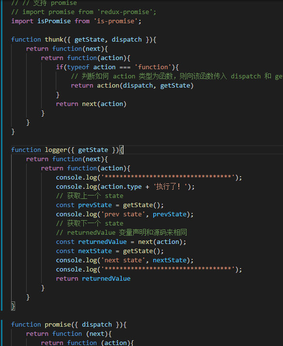
    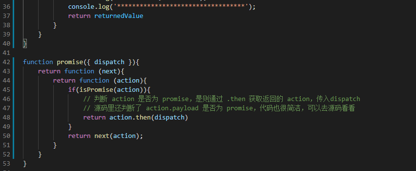

    其他地方不需要修改，结果图如下：👇👇👇

    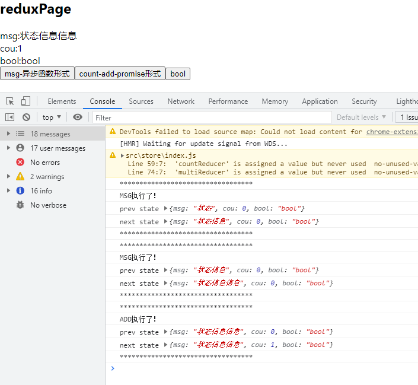

    可以看到引入自己实现的中间件后，dispatch 仍然支持函数和 promise 形式，浏览器也打印了日志记录，

    虽然没那么美观，不过也可以用了✌

## 总结

到这里一个简版的 redux 包括一些中间件就基本实现了，发现哪里出错或有问题的欢迎您评论区留言

或提 issue ：) [仓库地址](https://github.com/cao-lianhui/react-study-notes/tree/main/src/redux-mini)

## 参考链接

[1.阮一峰-Redux 入门教程（一）：基本用法](https://www.ruanyifeng.com/blog/2016/09/redux_tutorial_part_one_basic_usages.html)

[2.Redux 进阶教程](https://github.com/kenberkeley/redux-simple-tutorial/blob/master/redux-advanced-tutorial.md)

[3.redux 中文文档](https://www.redux.org.cn/)


